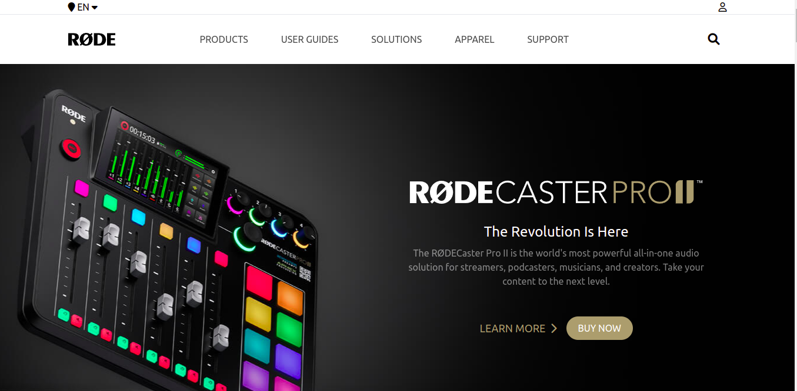

# Rode Clone

Creating a rode clone using tailwind css including responsive design

### This site is built using
> - HTML
> - Tailwind CSS
> - Fontawesome 

## What is HTML?
HTML stands for Hyper Text Markup Language It is the standard markup language for creating Web pages
and it describes the structure of a Web page.
HTML consists of a series of elements, and the elements tell the browser how to display the content.

## What is Tailwind CSS?
Tailwind CSS makes it quicker to write and maintain the code of your application. By using this utility-first framework, you don't have to write custom CSS to style your application. Instead, you can use utility classes to control the padding, margin, color, font, shadow, and more of your application.

## What is Fontawesome?
Font Awesome is the world's most popular icon set and toolkit. It is a widely-used icon set that gives you scalable vector images that can be customized with CSS

